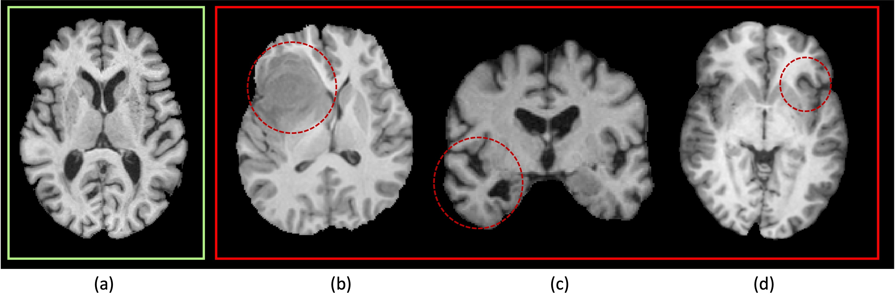

# Symmetry Awareness Encoded Deep Learning Framework for Brain Imaging Analysis

This repository contains the implementation of the Symmetry Awareness Encoded Deep Learning Framework for brain imaging analysis, as described in our MICCAI 2024 paper.

## Overview

The heterogeneity of neurological conditions, ranging from structural anomalies to functional impairments, presents significant challenges in medical imaging analysis tasks. This study introduces a novel approach leveraging the inherent anatomical symmetrical features of the human brain to enhance detection and segmentation analysis for brain diseases.

## Key Features

- **Symmetry-Aware Cross-Attention (SACA) Module**: Encodes symmetrical features of left and right hemispheres to enhance the model's understanding of brain anatomy.
- **Symmetry-Aware Head (SAH)**: Guides the pre-training of the whole network on a vast 3D brain imaging dataset, improving the performance on downstream tasks.
- **Multi-Modal Compatibility**: Tested on both MRI and CT modalities, demonstrating significant improvements in classification and segmentation tasks.

## Figures

### Brain Imaging Examples

*Fig. 1: Brain T1 images: (a) represents a healthy case, displaying symmetrical shape, structure, and image intensity. (b)-(d) depict patients with a brain tumor, Alzheimer’s Disease, and focal epilepsy, respectively, and the noticeable structural asymmetry parts are circled out.*

### Symmetry-Aware Cross-Attention (SACA) Module

*Fig. 2: Symmetry-Aware Cross-Attention (SACA) Module: (a) The computation of attention for each token within the SACA module; (b) Cross-attention calculation of SACA module structure.*

### Model Framework

*Fig. 3: (a) The process of midway registration to align input images; (b) The framework applied to input sub-volumes and their sagittal symmetrical counterparts. This framework is augmented by the Symmetry-Aware Cross-Attention (SACA) module and is optimized through a composite loss function that integrates inpainting, rotation, contrastive, and symmetry losses.*


## Installation

1. Clone the repository:
    ```bash
    git clone https://github.com/bitMyron/sa-swin.git
    cd sa-swin
    ```

2. Install the required packages:
    ```bash
    pip install -r requirements.txt
    ```

## Usage

### Pre-training

An example to pre-train the model with your dataset, run:
```bash
python main_asymmetry_pretrain.py \
--feature_size=48 \
--batch_size=64 \
--logdir=./runs/asymmetry_pretrain/mri/swinuni \
--fold=0 \
--lr=6e-6 \
--roi_x=160 \
--roi_y=160 \
--roi_z=160  \
--in_channels=1 \
--spatial_dims=3 \
--max_epochs=100 \
--warmup_epochs=10 \
--lr_schedule=warmup_cosine \
--loss_type=cosine \
--val_every=100 \
--json_dir='./datasets/pretrain/mri_all/jsons/asymmetry_training.json' \
--data_dir=/ \
--use_checkpoint \
--workers=1 \
--lrdecay \
--num_classes=2 
  ```

### Fine-tuning

An example for fine-tuning the pre-trained model on a classification task:
```bash
python main_saca_classifier.py \
--feature_size=48 \
--batch_size=32 \
--logdir=./runs/eplipesy/swinmlp_uni_${TIMESTAMP} \
--fold=0 \
--lr=1e-4 \
--roi_x=178 \
--roi_y=208 \
--roi_z=178  \
--in_channels=1 \
--spatial_dims=3 \
--max_epochs=50 \
--lr_schedule=warmup_cosine \
--warmup_epochs=5 \
--val_every=10 \
--json_dir='./datasets/epilepsy/jsons/epilepsy.json' \
--resume_checkpoint='./asymmetry_pretrain/mri/swinuni/model_bestValRMSE.pt' \
--data_dir=/ \
--use_checkpoint \
--num_classes=2 \
--class_weights='[1, 1]' \
--noamp
```

### Fine-tuning

An example for fine-tuning the pre-trained model on a classification task:
```bash
python main_classification.py \
--feature_size=48 \
--batch_size=32 \
--logdir=./runs/eplipesy/swinmlp_uni_${TIMESTAMP} \
--fold=0 \
--lr=1e-4 \
--roi_x=178 \
--roi_y=208 \
--roi_z=178  \
--in_channels=1 \
--spatial_dims=3 \
--max_epochs=50 \
--lr_schedule=warmup_cosine \
--warmup_epochs=5 \
--val_every=10 \
--json_dir='./datasets/epilepsy/jsons/epilepsy.json' \
--resume_checkpoint='./runs/pretrain/pretrain_mri_t1/model_bestValRMSE.pt' \
--data_dir=/ \
--use_checkpoint \
--num_classes=2 \
--class_weights='[1, 1]' \
--noamp
```


## Dataset

- MRI Dataset: 3D T1 images of 3,509 healthy adults and 2,917 patients.
- CT Dataset: 2,025 images from healthy individuals and 4,693 images from patients with various brain diseases.

Please ensure you have the appropriate permissions to use and share these datasets.

## Results

Our model demonstrates superior performance over state-of-the-art methodologies, particularly highlighting the significance of symmetry-aware learning in medical imaging analysis. Detailed results and comparisons are available in our paper.

## Acknowledgements

We would like to thank our collaborators and the institutions that provided the datasets used in this research. For more details, please refer to the Acknowledgements section of our paper.

We would also like to thank the MONAI Project for their development of the Swin UNETR model, which our project is based on. MONAI is an AI toolkit for healthcare imaging, providing state-of-the-art, end-to-end training workflows for medical image analysis. For more details, please refer to their [GitHub repository](https://github.com/Project-MONAI/MONAI).


## License

This project is licensed under the MIT License. See the LICENSE file for details.

[//]: # (## Citation)

[//]: # ()
[//]: # (If you find our work useful in your research, please cite:)

[//]: # (```)

[//]: # (@inproceedings{paper,)

[//]: # (  title={Symmetry Awareness Encoded Deep Learning Framework for Brain Imaging Analysis},)

[//]: # (  author={Your Name and Collaborators},)

[//]: # (  booktitle={MICCAI 2024},)

[//]: # (  year={2024})

[//]: # (})

[//]: # (```)

## Contact

For any questions or issues, please contact us at [yama5878@uni.sydney.edu.au](mailto:yama5878@uni.sydney.edu.au).
